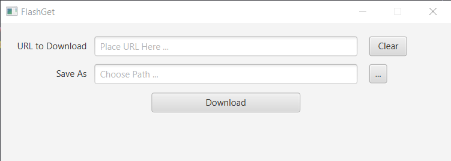
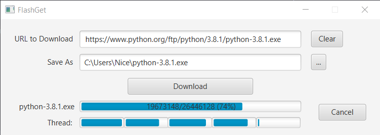
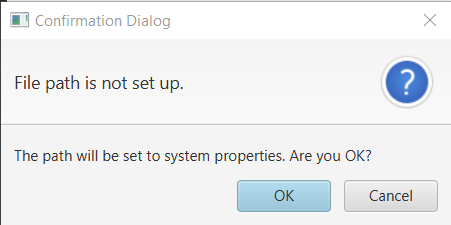
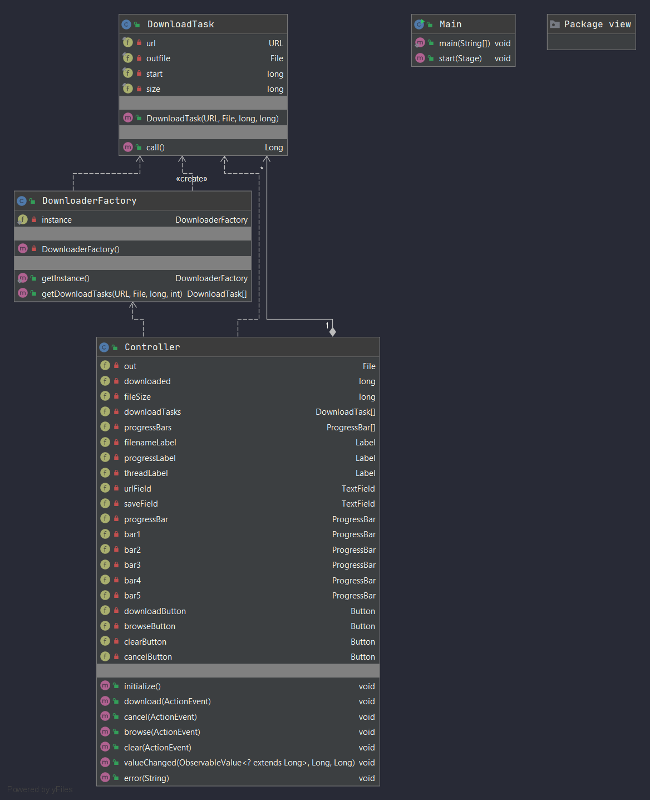

# Programming Assignment 4

## FlashGet

FlashGet is a downloader app with GUI that can download a file from url and can choose a path to save a file.

***

### Interface
A normal interface.

When downloading.

- **URL Field** to enter the url of the file.
- **Save Field** to select path to save file.
- **Download Button** to start downloading.
- **Clear Button** for clear the fields.
- **Browse Button** for a browse the file path from your computer.
- **Cancel Button** to cancel the downloading. It will be shown when downloading is in progress.

***

### Features

* If you click Download button without setting the file path, it will be set to system properties (C:\Users\PC).
There will be the confirmation dialog for confirmation.

* You can choose the path by click Browse [ ... ] button

***

### Usage

#### How to run jar file.

Type below syntax in the command line:

`
java --module-path="[path to javafx lib]" --add-modules javafx.controls -jar FlashGet.jar
`

#### How to use.

1. Enter the url of the file to URL field.
2. Click Download button then it will save the file to initial path or click browse to select path by yourself.
3. Click Download button again.
4. It will start downloading, and you can cancel anytime.

***

#### Educational Value

* How to use I/O to get data from url.
* Learn how to use more nodes in JavaFX such as progress bar, file chooser.
* Learn to use worker thread to update the indicator of progress bar and update percent of downloaded.
* Use FXML to create a user interface.
* Learn how to use tools in SceneBuilder.

#### Design Patterns

* Observer Pattern
* Singleton Pattern
* Factory Pattern

***

### UML Class Diagram

